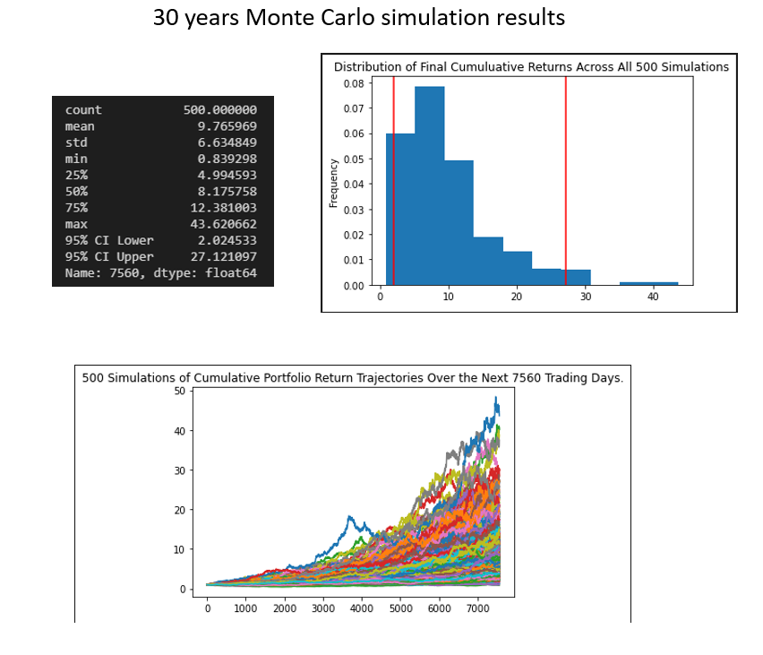

# financial_plan_api_cryp_bond_stocks
## Table of Contents

* General Information
     * Personal financial planner - Assess current portfolio health
     * Long-term retirement planning
     * Short-terms alternatives (5 year and 10 year)

* Libraries and tools

## Personal financial planner

* The financial health of a given portfolio was prepared with the assumption of a crypto portfolio composed of 1.2 Bitcoin and 5.3 ethereum and an equity portfolio composed of 50 shares of the ETF (SPY) and 200 shares of the bond ETF (AGG).
* The daily close price for the cryptocurrencies were obtained via API url from alternative.me, while the equity daily close were obtained via Alpaca SDK API.
* Overall, 71% of the combined portfolio is equity shares.
* The total amount held in savings surpased the minimum requirement for emergency funds. 

## Long-Term retirement planning

* To assess a 30-year retirement porfolio, 5 years of stock data were obtained using Alpaca API keys.
* Then, using Monte Carlo simulation, 500 random runs projected to 30 years were generated maintaining a 60/40 ratio of AGG and SPY shares.
* The distribution chart reveal that the forecast doesn't follow a standard distribution.

## Alternative retirement planning

* To reduce the timeline for retirement, 2 cases were run assuming a larger ratio on SPY stocks 60 vs 40 AGG Bonds and an initial investment of USD 60,000.
* For the 5 years projection the portfolio ranges from $56424.31 and $112842.91, while the 10 years ranges from $63783.11 and $175824.13.

## Libraries and tools

* To complete the Monte Carlo iterations, the MCForecastTools.py was used
* the libraries imported to the analysis: os, requests, pandas, dotenv, json and alpaca_trade_api  